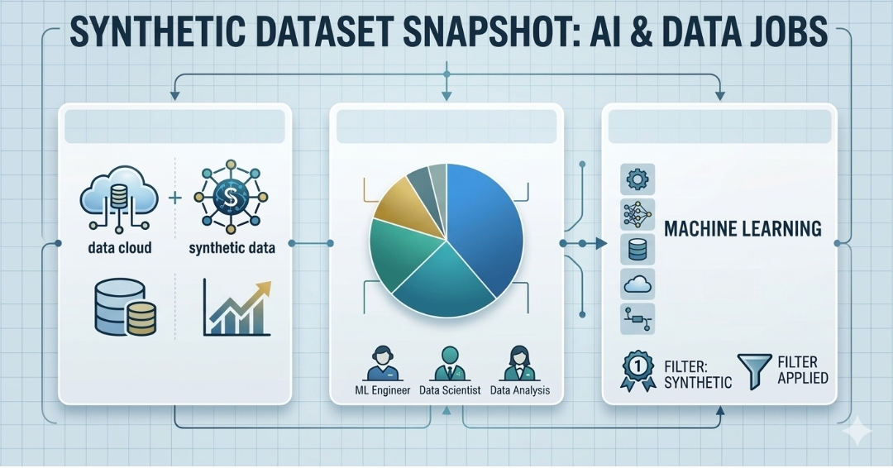
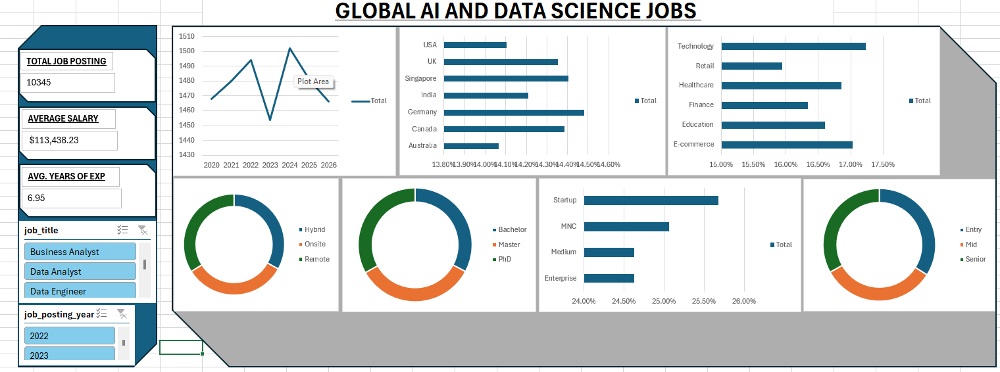
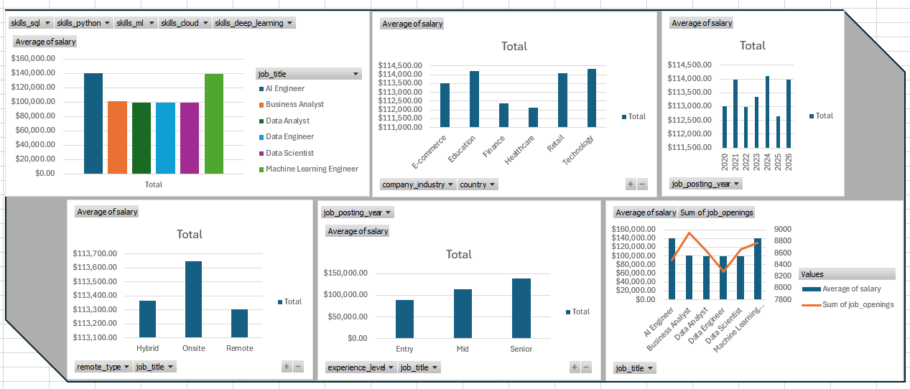

# ANALYSIS AI/ML DATA-SCIENCE JOB MARKET TRENDS 2020-2026
## BRIEF INTRODUCTION

This report analyzes a synthetic dataset of Data Science and related (AI, Machine Learning (ML)) job postings.It explores hiring patterns, salary variations, skill demands, remote/hybrid trends, and market dynamics across multiple countries and industries. The goal is to provide actionable insights for job seekers, recruiters, hiring managers, and industry analysts.

## ABOUT THE DATASET
The dataset contains thousands of synthetic job postings for AI/ML/Data roles and provides information across multiple domains. The key columns are structured as follows: 
- **Domain 1** – Job Postings: Core job details including job id, job title (AI Engineer, Machine Learning Engineer, Data Scientist, Data Analyst, Business Analyst, Data Engineer, etc.), company size (Startup, Medium, Enterprise, MNC), company industry (Technology, Finance, Healthcare, Retail, E-commerce, Education, etc.), country (USA, Germany, Canada, Australia, UK, India, Singapore, etc.), remote type (Remote, Hybrid, Onsite), experience level (Entry, Mid, Senior), years of experience, education level (Bachelor, Master, PhD), salary (annual USD), year of job posting (2020–2026), hiring urgency (High/Medium/Low), and job openings.  
- **Domain 2** – Skills & Requirements: Binary skill flags (python, sql, ml, deep learning, cloud, etc.) linked to each job posting, plus experience and education requirements.  
- **Domain 3** – Aggregated Metrics: Summary/hiring metrics, demand scores, and derived calculations (e.g., salary bands, urgency levels) across the dataset.

The [data](https://docs.google.com/spreadsheets/d/1T5GTI9t4W1NlR3XNsBTnKBcMiWgEgcWB/edit?usp=sharing&ouid=103589322135314678768&rtpof=true&sd=true) spans multiple ID blocks and simulates real-world variability in job market conditions

## PROBLEM STATEMENT
Using this comprehensive synthetic dataset of AI/ML/Data job postings, the task is to analyze current and emerging trends in the global tech job market. Key questions include: What drives salary differences? Which skills and experience levels are most in demand? How do remote vs. onsite roles compare? And what insights can guide career decisions and hiring strategies in a rapidly evolving AI landscape?.

## VISUALIZATION

## INSIGHTS 
Senior-level roles (especially AI Engineer and Machine Learning Engineer) command significantly higher salaries (often $150k–$165k range) compared to Mid or Entry levels, with a clear premium for Master’s or PhD qualifications.  
Remote positions consistently show lower salaries than Onsite roles, particularly in the USA, Canada, and Australia. Hybrid roles fall in between, indicating strong market demand for location flexibility.  
Python and Machine Learning skills appear in the majority of high-salary postings, followed by SQL, Deep Learning, and Cloud technologies. Jobs requiring multiple core skills (e.g., Python + ML + Cloud) correlate with the highest salaries and hiring urgency.  
The Technology and Education sector dominate high-paying opportunities, while the USA leads in both salary levels and number of openings. Germany and Australia also show strong demand for Mid-to-Senior talent.  
Job postings from 2026 show increasing hiring urgency and higher average salaries compared to 2020–2025, reflecting continued growth in AI adoption across sectors.  
Business Analyst and Data Analyst roles have lower average salaries (~$90k–$110k) but higher volume of openings, suggesting more entry-to-mid opportunities for candidates with foundational skills.

## RECOMMENDATION
- **For Job Seekers:** Prioritize Python, ML/Deep Learning, and Cloud skills. Target Senior roles if you have 5+ years of experience and a Master’s degree. Consider Onsite positions in the USA/Canada for maximum compensation.  
- **For Companies/Hiring Managers:** Offer competitive remote/hybrid packages to attract top talent. Invest in upskilling programs focused on emerging AI tools to reduce hiring urgency and fill gaps faster.  
- **For Career Development:** Focus on continuous learning in high-demand areas (ML, Cloud). Entry-level candidates should build portfolios demonstrating Python/SQL projects.  
- Regularly monitor salary trends by country and industry to stay competitive in offers and negotiations. 
- Expand hiring in high-growth sectors (Technology, Finance, Healthcare) and consider international talent pools to meet rising demand.

## CONCLUSION
The synthetic AI/ML/Data job dataset reveals a robust and expanding job market driven by AI adoption. Salaries are strongly influenced by experience, skills (especially Python + ML), location, and remote flexibility. While Senior technical roles command premium pay, there are abundant opportunities across all levels. Companies that embrace invest in skill-aligned hiring will gain a competitive edge. Overall, the data points to strong continued growth in the AI/Data sector through 2026 and beyond, making it an excellent time for professionals to invest in relevant skills and for organizations to scale their tech teams strategically.
